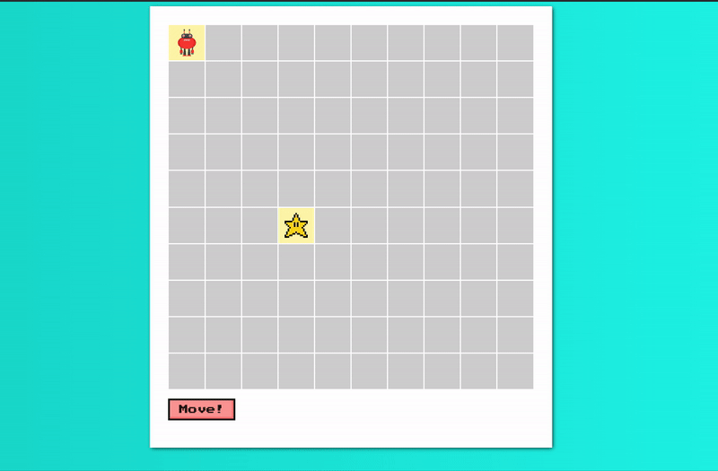
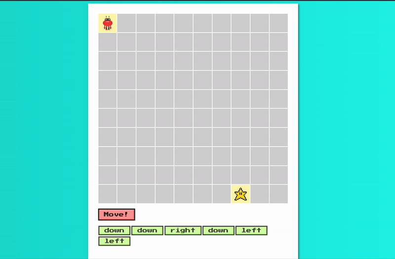

Robot Simulator v3
================
*This DQ Lovingly Stolen From [The Masta Balasta](https://github.com/sbal13)*

Welcome to Robot Simulator! We're building a digital space for a robot to move around in! We've got the robot and the robot's got the moves, but it's up to you figure out how to get the user to control how it moves!

## Objectives
- [ ] Gain a better understanding of DOM management
- [ ] Learn how to manage data on the frontend
- [ ] Use event listeners in new and interesting ways

## Task

Open up the `index.html` file in your browser and please read **all** of the instructions before beginning. 

You will be coding only within the `index.js` file - the `movement.js` file provides you with the code to move the robot. You can peek at this code if you're curious, but it is not advised that you edit it.

We've got a robot displayed in a grid. The robot is capable of moving along this grid using a function called `move` which has been provided for you. When called with a string `left`, `down`, `right`, or `up`, the `move` function will move the robot in that direction. Try it out in your console! 

Example: 
```
move("right") // moves robot to the right
```

### Store the commands

Your task is to add functionality to the page such that _when a user presses the arrow keys_, that direction (i.e. `left`, `down`, `right`, or `up`) is added to a list of directions on the right side of the robot's grid. We've already provided you with a `<ul>` element with an id set to `moves-container` - you just have to add `li` elements to it containing the direction that was inputted.

Example:

```html
<ul id="moves-container">
  <li>Down</li>
  <li>Right</li>
  <li>Down</li>
  <li>Right</li>
</ul>
```



### Move the robot

The robot does **NOT** move until the user presses the `Move!` button. _When this button is clicked_, the direction at the top should be removed from the moves container `<ul>` and the robot should move in that direction. 

Note: If the robot hits a wall, it will not move and you will instead see a `alert` saying "Clang! Hit a wall"


### Delete a move

_When a user clicks on a move `<li>`_, delete that move from the moves container `<ul>`.

Note: think about using Event Delegation vs attaching individual event listeners to each new list item. What edge cases do you need to handle?




### Bonus!

_When the "Move!" button is clicked_, the robot automatically moves according the the list of directions every half second. The directions should disappear from your list of directions as the robot moves. You may want to look into `setInterval`  or `setTimeout`.
